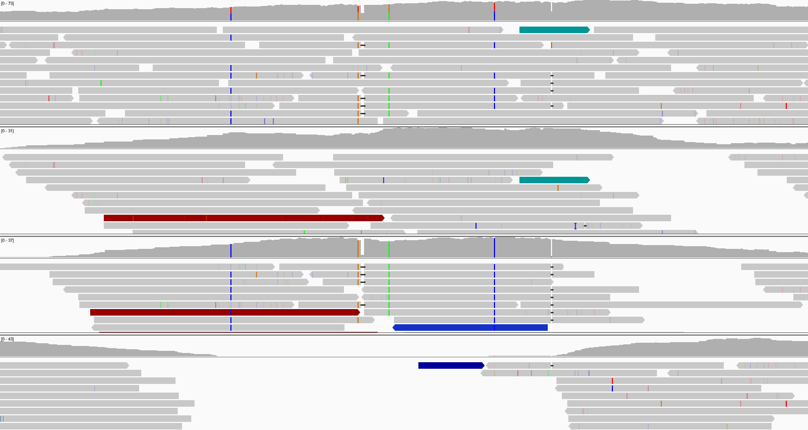

# bamsplit

**bamsplit** is a simple Python3 tool for splitting a SAM format file by reads supporting different haplotypes present in a phased VCF file. This can be useful for visualisation, but also for splicing variants into reads from a single haplotype.  

The tool takes a VCF file which contains variants present in an individual and a BAM file containing sequencing reads from the same individual. These reads may or may not be the ones used to call the input variants. The variants should be phased to the greatest extent possible as this improves read assignment accuracy. The tool then produces three new BAM files: two for reads supporting each haplotype in the sample, and a third for reads that cannot be assigned to a haplotype. An example input and output are shown below. 

## Requirements

- Python3
- [pysam](http://pysam.readthedocs.io/en/latest/)
- [SSW](https://github.com/vishnubob/ssw)

## Limitations

- Only diploid samples are supported.
- If the supplied variant calls are not accurate, the assignments will likely be wrong.
